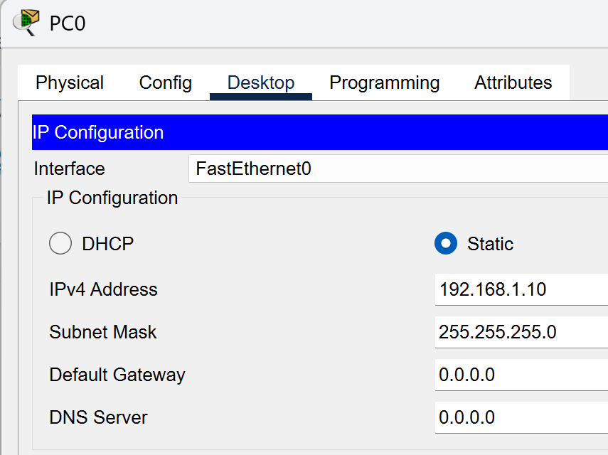

# Базовая настройка коммутатора.

###  Топология:


###  Таблица адресации:

| Устройство  | Интерфейс | IP-адрес / префикс       | 
|-------------|-----------|--------------------------|
|     S1      |   VLAN 1  | 192.168.1.2 /24          | 
|    PC-A     |   NIC     | 192.168.1.10 /24         |

###  Задание:

  [Часть 1. Проверка конфигурации коммутатора по умолчанию;](#часть-1-проверка-конфигурации-коммутатора-по-умолчанию)

  [Часть 2. Создание сети и настройка основных параметров устройства;](#часть-2-создание-сети-и-настройка-основных-параметров-устройства)
  - настройте базовые параметры коммутатора;
  - настройте ip-адрес для пк.

  [Часть 3. Проверка сетевых подключений](#часть-3-проверка-сетевых-подключений)

###  Решение:
####  Часть 1. Проверка конфигурации коммутатора по умолчанию

Ответы на вопросы:

1. Почему нужно использовать консольное подключение для первоначальной настройки коммутатора? Почему нельзя подключиться к коммутатору через Telnet или SSH? 

> *Консольное подключение необходимо использовать для первоначальной настройки. У нового коммутатора нет сетевых настроек. Через Telnet или SSH подключиться нельзя из-за отсутствия IP-адреса*

2. Сколько интерфейсов FastEthernet имеется на коммутаторе 2960?

> *24*

3. Сколько интерфейсов Gigabit Ethernet имеется на коммутаторе 2960?
> *2*

4. Каков диапазон значений, отображаемых в vty-линиях?
>*16*

5. Назначен ли IP-адрес сети VLAN 1? 
> *нет*

6. VLAN 1 интерфейс включен? 
> *нет (shutdown)*

7. Изучите IP-свойства интерфейса SVI сети VLAN 1.
Какие выходные данные вы видите? 
> *ip add не назначен*

8. Подсоедините кабель Ethernet компьютера PC-A к порту 6 на коммутаторе и изучите IP-свойства интерфейса SVI сети VLAN 1. Дождитесь согласования параметров скорости и дуплекса между коммутатором и ПК.
Какие выходные данные вы видите?

```
Switch#
%LINK-5-CHANGED: Interface FastEthernet0/6, changed state to up
%LINEPROTO-5-UPDOWN: Line protocol on Interface FastEthernet0/6, changed state to up 
```

 `%LINK-5-CHANGED` – физический уровень (layer 1) – поднялся

 `%LINEPROTO-5-UPDOWN` – канальный уровень (layer 2) – поднялся

9. Под управлением какой версии ОС Cisco IOS работает коммутатор? 
> *15.0(2)SE4*

10. Как называется файл образа системы? 
> *2960-lanbasek9-mz.150-2.SE4.bin*

11. Изучите свойства по умолчанию интерфейса FastEthernet, который используется компьютером PC-A.
Switch# show interface f0/6 
Интерфейс включен или выключен? 
> включен, `FastEthernet0/6 is up, line protocol is up (connected)`
Что нужно сделать, чтобы включить интерфейс? 

> *no shutdown*

12. Изучите флеш-память. Switch# show flash 
Какое имя присвоено образу Cisco IOS? 

> *2960-lanbasek9-mz.150-2.SE4*

13. Для чего нужна команда login при настройке vty?

> *login указывает, что надо использовать пароль, заданный командой password на линии.*

14. Зачем необходимо настраивать пароль VTY для коммутатора? 

> *Защита от несанкционированного удаленного доступа*

15. Что нужно сделать, чтобы пароли не отправлялись в незашифрованном виде?

> *нужно использовать ssh вместо telnet, чтобы пароли не отправлялись в незашифрованном виде, используем команду service password-encryption, чтобы не видеть в явно виде пароли в show run.*

#### Часть 2. Создание сети и настройка основных параметров устройства
##### Шаг 1. Настройте базовые параметры коммутатора.

```
### Базовая настройка
conf t
no ip domain-lookup
hostname S1
service password-encryption
enable secret class
banner motd #
Unauthorized access is strictly prohibited. #
```
```
# Настройка ip add на SVI 1
interface vlan 1
ip address 192.168.1.2 255.255.255.0
no shut
```
```
### Настройка консольного доступа
# Настройка пароля
line console 0
password cisco
login

# Остановка вывода консольных сообщений
logging synchronous
```
```
### Настройка VTY
# Telnet
line vty 0 4
password cisco
login
```

##### Шаг 2. Настройте IP-адрес на компьютере PC-A.



#### Часть 3. Проверка сетевых подключений
##### Шаг 1. Отобразите конфигурацию коммутатора.

```
S1#show run
Building configuration...

Current configuration : 1293 bytes
!
version 15.0
no service timestamps log datetime msec
no service timestamps debug datetime msec
service password-encryption
!
hostname S1
!
enable secret 5 $1$mERr$9cTjUIEqNGurQiFU.ZeCi1
!
!
!
no ip domain-lookup
!
!
!
spanning-tree mode pvst
spanning-tree extend system-id
!
interface FastEthernet0/1
!
interface FastEthernet0/2
!
interface FastEthernet0/3
!
interface FastEthernet0/4
!
interface FastEthernet0/5
!
interface FastEthernet0/6
!
interface FastEthernet0/7
!
interface FastEthernet0/8
!
interface FastEthernet0/9
!
interface FastEthernet0/10
!
interface FastEthernet0/11
!
interface FastEthernet0/12
!
interface FastEthernet0/13
!
interface FastEthernet0/14
!
interface FastEthernet0/15
!
interface FastEthernet0/16
!
interface FastEthernet0/17
!
interface FastEthernet0/18
!
interface FastEthernet0/19
!
interface FastEthernet0/20
!
interface FastEthernet0/21
!
interface FastEthernet0/22
!
interface FastEthernet0/23
!
interface FastEthernet0/24
!
interface GigabitEthernet0/1
!
interface GigabitEthernet0/2
!
interface Vlan1
 ip address 192.168.1.2 255.255.255.0
!
banner motd ^C
Unauthorized access is strictly prohibited. ^C
!
!
!
line con 0
 password 7 0822455D0A16
 logging synchronous
 login
!
line vty 0 4
 password 7 0822455D0A16
 login
line vty 5 15
 login
!
!
!
!
end
```

##### Шаг 2. Протестируйте сквозное соединение, отправив эхо-запрос.
```
C:\>ping 192.168.1.10 

Pinging 192.168.1.10 with 32 bytes of data:

Reply from 192.168.1.10: bytes=32 time<1ms TTL=128
Reply from 192.168.1.10: bytes=32 time=8ms TTL=128
Reply from 192.168.1.10: bytes=32 time=1ms TTL=128
Reply from 192.168.1.10: bytes=32 time=21ms TTL=128

Ping statistics for 192.168.1.10:
Packets: Sent = 4, Received = 4, Lost = 0 (0% loss),
Approximate round trip times in milli-seconds:
Minimum = 0ms, Maximum = 21ms, Average = 7ms

C:\>ping 192.168.1.2

Pinging 192.168.1.2 with 32 bytes of data:

Request timed out.
Reply from 192.168.1.2: bytes=32 time<1ms TTL=255
Reply from 192.168.1.2: bytes=32 time<1ms TTL=255
Reply from 192.168.1.2: bytes=32 time<1ms TTL=255

Ping statistics for 192.168.1.2:
Packets: Sent = 4, Received = 3, Lost = 1 (25% loss),
Approximate round trip times in milli-seconds:
Minimum = 0ms, Maximum = 0ms, Average = 0ms
```

##### Шаг 3. Проверьте удаленное управление коммутатором S1.
```
C:\>telnet 192.168.1.2
Trying 192.168.1.2 ...Open
Unauthorized access is strictly prohibited. 


User Access Verification

Password: 
S1>
```