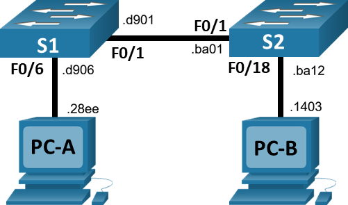

# Просмотр таблицы MAC-адресов.

###  Топология:


###  Таблица ip адресации:

| Устройство  | Интерфейс | IP-адрес / префикс       | 
|-------------|-----------|--------------------------|
|     S1      |   VLAN 1  | 192.168.1.11 /24         |
|     S2      |   VLAN 1  | 192.168.1.12 /24         |  
|    PC-A     |   NIC     | 192.168.1.1 /24          |
|    PC-B     |   NIC     | 192.168.1.12 /24         |

###  Таблица mac адресации:

| Устройство  | Интерфейс | IP-адрес / префикс       | 
|-------------|-----------|--------------------------|
|     S1      |   Fa0/1   | 0000.0c45.d901           |
|     S1      |   Fa0/6   | 0000.0c45.d906           | 
|     S1      |   CPU     | 0030.f296.d1e0           | 
|     S2      |   Fa0/1   | 0001.42e0.ba01           |
|     S2      |   Fa0/18  | 0001.42e0.ba12           | 
|     S2      |   CPU     | 0060.705a.1970           |    
|    PC-A     |   NIC     | 00d0.ffd3.28ee           |
|    PC-B     |   NIC     | 0001.c922.1403           |

###  Задание:

  [Часть 1. Создание и настройка сети;](#часть-1-создание-и-настройка-сети)

  [Часть 2. Изучение таблицы МАС-адресов коммутатора;](#часть-2-изучение-таблицы-МАС-адресов-коммутатора)


###  Решение:
####  Часть 1. Создание и настройка сети

### Базовая настройка свичей S1 и S2.
Команды даны для настройки S1 свича.

Для настройки S2 используется:

hostname S2

ip address 192.168.1.12 255.255.255.0

```
conf t
no ip domain-lookup
hostname S1
service password-encryption
enable secret class
banner motd #
Unauthorized access is strictly prohibited. #

interface vlan 1
ip address 192.168.1.11 255.255.255.0
no shut

line console 0
password cisco
login

logging synchronous

line vty 0 4
password cisco
login
```

*Подробнее базовая настройка свичей рассмотрена в LAB01.*

#### Часть 2. Изучение таблицы МАС-адресов коммутатора

### Шаг 1. Запишите МАС-адреса сетевых устройств.


PC-A:
```
C:\>ipconfig/all

FastEthernet0 Connection:(default port)

   Connection-specific DNS Suffix..: 
   Link-local IPv6 Address.........: FE80::2D0:FFFF:FED3:28EE
   IPv6 Address....................: ::
   IPv4 Address....................: 192.168.1.1
   Subnet Mask.....................: 255.255.255.0

C:\>arp -a
No ARP Entries Found
```
PC-B:
```
C:\>ipconfig/all

FastEthernet0 Connection:(default port)

   Connection-specific DNS Suffix..: 
   Link-local IPv6 Address.........: FE80::201:C9FF:FE22:1403
   IPv6 Address....................: ::
   IPv4 Address....................: 192.168.1.2
   Subnet Mask.....................: 255.255.255.0

C:\>arp -a
No ARP Entries Found
```

S1:
```
S1#show interface F0/1 
FastEthernet0/1 is up, line protocol is up (connected)
  Hardware is Lance, address is 0000.0c45.d901 (bia 0000.0c45.d90

S1#show interface F0/6
FastEthernet0/6 is up, line protocol is up (connected)
  Hardware is Lance, address is 0000.0c45.d906 (bia 0000.0c45.d906)
```
S2:
```
S2#show interfaces fa0/1
FastEthernet0/1 is up, line protocol is up (connected)
  Hardware is Lance, address is 0001.42e0.ba01 (bia 0001.42e0.ba01)
 
S2#show interfaces fa0/18
FastEthernet0/18 is up, line protocol is up (connected)
  Hardware is Lance, address is 0001.42e0.ba12 (bia 0001.42e0.ba12)
```

### Шаг 2. Просмотрите таблицу МАС-адресов коммутатора.

До тестирования сетевой связанности:
```
S1#show mac address-table 
          Mac Address Table
-------------------------------------------

Vlan    Mac Address       Type        Ports
----    -----------       --------    -----

   1    0001.42e0.ba01    DYNAMIC     Fa0/1
   

S2#show mac address-table 
          Mac Address Table
-------------------------------------------

Vlan    Mac Address       Type        Ports
----    -----------       --------    -----

   1    0000.0c45.d901    DYNAMIC     Fa0/1
```


После тестирования сетевой связанности
PC-A ping PC-B:

PC-A: ping 192.168.1.12

PC-A:
```
C:\>arp -a
  Internet Address      Physical Address      Type
  192.168.1.12          0060.705a.1970        dynamic
```

PC-B:
```
C:\>arp -a
No ARP Entries Found
```


S1:
```
S1#show mac address-table 
          Mac Address Table
-------------------------------------------

Vlan    Mac Address       Type        Ports
----    -----------       --------    -----

   1    0001.42e0.ba01    DYNAMIC     Fa0/1
   1    0060.705a.1970    DYNAMIC     Fa0/1
   1    00d0.ffd3.28ee    DYNAMIC     Fa0/6
```


S2:
```
S2#show mac address-table 
          Mac Address Table
-------------------------------------------

Vlan    Mac Address       Type        Ports
----    -----------       --------    -----

   1    0000.0c45.d901    DYNAMIC     Fa0/1
   1    00d0.ffd3.28ee    DYNAMIC     Fa0/1
```


PC-B ping PC-A:

PC-B: ping 192.168.1.11

PC-A:
```
C:\>arp -a
  Internet Address      Physical Address      Type
  192.168.1.12          0060.705a.1970        dynamic
```

PC-B:
```
C:\>arp -a
  Internet Address      Physical Address      Type
  192.168.1.11          0030.f296.d1e0        dynamic
```


S1:
```
S1#show mac address-table 
          Mac Address Table
-------------------------------------------

Vlan    Mac Address       Type        Ports
----    -----------       --------    -----

   1    0001.42e0.ba01    DYNAMIC     Fa0/1
   1    0001.c922.1403    DYNAMIC     Fa0/1
   1    0060.705a.1970    DYNAMIC     Fa0/1
   1    00d0.ffd3.28ee    DYNAMIC     Fa0/6
```


S2:
```
S2#show mac address-table 
          Mac Address Table
-------------------------------------------

Vlan    Mac Address       Type        Ports
----    -----------       --------    -----

   1    0000.0c45.d901    DYNAMIC     Fa0/1
   1    0001.c922.1403    DYNAMIC     Fa0/18
   1    0030.f296.d1e0    DYNAMIC     Fa0/1
   1    00d0.ffd3.28ee    DYNAMIC     Fa0/1
```


Ответы на вопросы:

1. Записаны ли в таблице МАС-адресов какие-либо МАС-адреса? 

> *Да, записан mac-адрес соседа - сетевого устройства*

2. Какие МАС-адреса записаны в таблице? С какими портами коммутатора они сопоставлены и каким устройствам принадлежат? Игнорируйте МАС-адреса, сопоставленные с центральным процессором.

> *S1: S2- Fa0/1 - 0001.42e0.ba01*

> *S2: S1- Fa0/1 - 0000.0c45.d901*

3. Если вы не записали МАС-адреса сетевых устройств в шаге 1, как можно определить, каким устройствам принадлежат МАС-адреса, используя только выходные данные команды show mac address-table? Работает ли это решение в любой ситуации?
> *Никак нельзя определить к каким устройствам принадлежат МАС-адреса, т.к. команда show mac address-table показывает за каким портом виден тот или иной mac-адрес. Поэтому если за портом только одно устроство - определить можно, если знать, что это за устройство, если несколько устройст - то определить нельзя.*


### Шаг 3. Очистите таблицу МАС-адресов коммутатора S2 и снова отобразите таблицу МАС-адресов.
После очистки таблицы mac-адрес свич S2 видит только mac-адрес соседа S1. Спустя 10 сек ситуация не изменилась.

```
S2#clear mac address-table dynamic
S2#show mac address-table 
          Mac Address Table
-------------------------------------------

Vlan    Mac Address       Type        Ports
----    -----------       --------    -----

   1    0000.0c45.d901    DYNAMIC     Fa0/1
   
   
### After 10 sec   
S2#show mac address-table 
          Mac Address Table
-------------------------------------------

Vlan    Mac Address       Type        Ports
----    -----------       --------    -----

   1    0000.0c45.d901    DYNAMIC     Fa0/1
```

### Шаг 4. С компьютера PC-B отправьте эхо-запросы устройствам в сети и просмотрите таблицу МАС-адресов коммутатора.
PC-B:
ping 192.168.1.1 (PC-A)
ping 192.168.1.11 (S1)
ping 192.168.1.12 (S2)


```
C:\>arp -a
  Internet Address      Physical Address      Type
  192.168.1.1           00d0.ffd3.28ee        dynamic
  192.168.1.11          0030.f296.d1e0        dynamic
  192.168.1.12          0060.705a.1970        dynamic
```


Ответы на вопросы:

1. Не считая адресов многоадресной и широковещательной рассылки, сколько пар IP- и МАС-адресов устройств было получено через протокол ARP
> *Если ранее с данного хоста не пинговались никакие устройства - пар нет*
```
C:\>arp -a
No AR
```


2. 
Выполнен:
PC-B:
ping 192.168.1.1 (PC-A)
ping 192.168.1.11 (S1)
ping 192.168.1.12 (S2)

От всех ли устройств получены ответы? Если нет, проверьте кабели и IP-конфигурации.
> *Да, от всех*


3. Добавил ли коммутатор в таблицу МАС-адресов дополнительные МАС-адреса? Если да, то какие адреса и устройства?
> *0001.c922.1403* - PC-B
> *0030.f296.d1e0* - S1-CPU
> *00d0.ffd3.28ee* - PC-A
```
S2#show mac address-table 
          Mac Address Table
-------------------------------------------

Vlan    Mac Address       Type        Ports
----    -----------       --------    -----

   1    0000.0c45.d901    DYNAMIC     Fa0/1
   1    0001.c922.1403    DYNAMIC     Fa0/18
   1    0030.f296.d1e0    DYNAMIC     Fa0/1
   1    00d0.ffd3.28ee    DYNAMIC     Fa0/1
S2#
```

4. Появились ли в ARP-кэше компьютера PC-B дополнительные записи для всех сетевых устройств, которым были отправлены эхо-запросы?
> *Да*
```
  192.168.1.1       00d0.ffd3.28ee        PC-A-NIC 
  192.168.1.11      0030.f296.d1e0        S1-CPU 
  192.168.1.12      0060.705a.1970        S2-CPU  
```

5. 	Вопрос для повторения
В сетях Ethernet данные передаются на устройства по соответствующим МАС-адресам. Для этого коммутаторы и компьютеры динамически создают ARP-кэш и таблицы МАС-адресов. Если компьютеров в сети немного, эта процедура выглядит достаточно простой. Какие сложности могут возникнуть в крупных сетях?

*1). большие таблицы, сложность обработки и поиска нужного устройства*

*2). при перемещении устройства за другой порт, свич видит один и тот же мак за разными портами. Администратор может подумать о петле.*

*3). если устройств множество внутри одного широковещательного домена много, то arp запрос могут создать дополнительную нагрузку на свич.*
