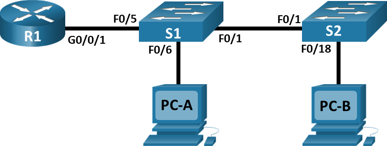

# Внедрение маршрутизации между виртуальными локальными сетями.

###  Топология:


###  Таблица адресации:

| Устройство  | Интерфейс     | IP-адрес       | Маска подсети     | Шлюз по умолчанию | 
|-------------|---------------|----------------|-------------------|-------------------|
|     R1      |   G0/0/0.10   | 192.168.10.1   |   255.255.255.0   |   ---             |
|     R1      |   G0/0/0.20   | 192.168.20.1   |   255.255.255.0   |   ---             |
|     R1      |   G0/0/0.30   | 192.168.30.1   |   255.255.255.0   |   ---             |
|     R1      |   G0/0/0.1000 | ---            |   ---             |   ---             |
|     S1      |   VLAN 10     | 192.168.10.11  |   255.255.255.0   |   192.168.10.1    |
|     S2      |   VLAN 10     | 192.168.10.12  |   255.255.255.0   |   192.168.10.1    |
|     PC-A    |   NIC         | 192.168.20.3   |   255.255.255.0   |   192.168.20.1    |
|     PC-B    |   NIC         | 192.168.20.3   |   255.255.255.0   |   192.168.30.1    |

###  Таблица VLAN:

| VLAN        | Интерфейс     | Назначенный интерфейс         | 
|-------------|---------------|-------------------------------|
|     10      |   Управление  | S1: VLAN 10                   |  
|     10      |   Управление  | S2: VLAN 10                   | 
|     20      |   Sales       | S1: F0/6                      |  
|     30      |   Operations  | C1: F0/2-4, F0/7-24, G0/1-2   |  
|     999     |   Paring_Lot  | C2: F0/2-17, F0/19-24, G0/1-2 |   


###  Задание:

  [Часть 1. Создание сети и настройка основных параметров устройства;](#часть-1-создание-сети-и-настройка-основных-параметров-устройства)

  [Часть 2. Создание сетей VLAN и назначение портов коммутатора;](#часть-2-создание-сетей-vlan-и-назначение-портов-коммутатора)

  [Часть 3. Настройка транка 802.1Q между коммутаторами;](#часть-3-конфигурация-магистрального-канала-стандарта-8021q-между-коммутаторами)

  [Часть 4. Настройка маршрутизации между сетями VLAN;](#часть-4-настройка-маршрутизации-между-сетями-vlan)

  [Часть 5. Проверка, что маршрутизация между VLAN работает;](#часть-5-проверьте-работает-ли-маршрутизация-между-vlan)


###  Решение:
###  Часть 1. Создание сети и настройка основных параметров устройства
**Настройка базовых параметров маршрутизатора и коммутатора .**
Команды даны для настройки R1 свича.

Для настройки S1 и S2 используется:

hostname S1

hostname S2

```
conf t
no ip domain-lookup
hostname R1
service password-encryption
enable secret class
banner motd #
Unauthorized access is strictly prohibited. #

line console 0
password cisco
login

logging synchronous

line vty 0 4
password cisco
login
```

*Подробнее базовая настройка рассмотрена в LAB01.*

Настройка ip add на интерфейсе G0/1 на маршрутизаторе R1:

```
interface gigabitEthernet 0/1
ip address 192.168.1.1 255.255.255.0
no shut
```

Настройка ip add на интерфейсе VLAN1 на маршрутизаторе S1:

```
interface vlan 1
ip address 192.168.1.11 255.255.255.0
no shut
```

**Настройка базовых параметров PC-A.**

```
C:\>ipconfig

FastEthernet0 Connection:(default port)

   Connection-specific DNS Suffix..: 
   Link-local IPv6 Address.........: FE80::290:21FF:FEE2:5DD5
   IPv6 Address....................: ::
   IPv4 Address....................: 192.168.20.3
   Subnet Mask.....................: 255.255.255.0
   Default Gateway.................: ::
                                     192.168.20.1

```

**Настройка базовых параметров PC-B.**

```
C:\>ipconfig

FastEthernet0 Connection:(default port)

   Connection-specific DNS Suffix..: 
   Link-local IPv6 Address.........: FE80::2E0:B0FF:FECA:D11D
   IPv6 Address....................: ::
   IPv4 Address....................: 192.168.30.3
   Subnet Mask.....................: 255.255.255.0
   Default Gateway.................: ::
                                     192.168.30.1

```


### Часть 2. Создание сетей VLAN и назначение портов коммутатора
**Шаг 1. Настройка VLAN на свичах.**

```
vlan 10
name Management

vlan 20
name Sales

vlan 30
name Operations

vlan 999
name Parking_Lot

vlan 1000
name Own
```

**Шаг 2. Настройка VLAN на свичах.**

S1:

```
interface vlan 10
ip address 192.168.10.11 255.255.255.0
no shut
exit
ip default-gateway 192.168.10.1
```

S2:

```
interface vlan 10
ip address 192.168.10.12 255.255.255.0
no shut
exit
ip default-gateway 192.168.10.1
```

**Шаг 3. Перевод неиспользуемых портов в VLAN 999 и их деактивация.**

S1:

```
interface range f0/2-4, f0/7-24, g0/1-2
switchport mode access
switchport access vlan 999
shutdown
exit
```

S2:

```
interface range f0/2-17, f0/19-24, g0/1-2
switchport mode access
switchport access vlan 999
shutdown
exit
```

**Шаг 4. Назначьте сети VLAN соответствующим интерфейсам коммутатора.**

S1:

```
int f0/6
switchport mode access
switchport access vlan 20
no shut

S1#show vlan br

VLAN Name                             Status    Ports
---- -------------------------------- --------- -------------------------------
1    default                          active    Fa0/1, Fa0/5
10   Management                       active    
20   Sales                            active    Fa0/6
30   Operations                       active    
999  Parking_Lot                      active    Fa0/2, Fa0/3, Fa0/4, Fa0/7
                                                Fa0/8, Fa0/9, Fa0/10, Fa0/11
                                                Fa0/12, Fa0/13, Fa0/14, Fa0/15
                                                Fa0/16, Fa0/17, Fa0/18, Fa0/19
                                                Fa0/20, Fa0/21, Fa0/22, Fa0/23
                                                Fa0/24, Gig0/1, Gig0/2
```

S2:

```
int f0/18
switchport mode access
switchport access vlan 30
no shut

S2#show vlan brief 

VLAN Name                             Status    Ports
---- -------------------------------- --------- -------------------------------
1    default                          active    Fa0/1
10   Management                       active    
20   Sales                            active    
30   Operations                       active    Fa0/18
999  Parking_Lot                      active    Fa0/2, Fa0/3, Fa0/4, Fa0/5
                                                Fa0/6, Fa0/7, Fa0/8, Fa0/9
                                                Fa0/10, Fa0/11, Fa0/12, Fa0/13
                                                Fa0/14, Fa0/15, Fa0/16, Fa0/17
                                                Fa0/19, Fa0/20, Fa0/21, Fa0/22
                                                Fa0/23, Fa0/24, Gig0/1, Gig0/2
```

### Часть 3. Конфигурация магистрального канала стандарта 802.1Q между коммутаторами
**Шаг 1. Вручную настройте магистральный интерфейс F0/1 на коммутаторах S1 и S2.**

S1:

```
int f0/1
switch mode trunk
switch trunk allowed vlan 10,20,30,1000
switch trunk native vlan 1000
switchport nonegotiation

int f0/5
switch mode trunk
switch trunk allowed vlan 10,20,30,1000
switch trunk native vlan 1000
switchport nonegotiation

show int trunk
```
Что произойдет, если G0/0/1 на R1 будет отключен?
> Порт F0/5 на S1 будет not connected


S2:

```
int f0/1
switch mode trunk
switch trunk allowed vlan 10,20,30,1000
switch trunk native vlan 1000
switchport nonegotiation

show int trunk
S2#show int trunk
Port        Mode         Encapsulation  Status        Native vlan
Fa0/1       on           802.1q         trunking      1000

Port        Vlans allowed on trunk
Fa0/1       10,20,30,1000

Port        Vlans allowed and active in management domain
Fa0/1       10,20,30,1000

Port        Vlans in spanning tree forwarding state and not pruned
Fa0/1       none

```

### Часть 4. Настройка маршрутизации между сетями VLAN

R1:

```
int G0/1.10
encapsulation dot1q 10
ip add 192.168.10.1 255.255.255.0

int G0/1.20
encapsulation dot1q 20
ip add 192.168.20.1 255.255.255.0

int G0/1.30
encapsulation dot1q 30
ip add 192.168.30.1 255.255.255.0

int G0/1
no shut
```


### Часть 5. Проверьте, работает ли маршрутизация между VLAN
PC-A ping GW (192.168.20.1):

```
C:\>ping 192.168.20.1

Pinging 192.168.20.1 with 32 bytes of data:

Reply from 192.168.20.1: bytes=32 time<1ms TTL=255
```

PC-A ping PC-B:

```
C:\>ping 192.168.30.3

Pinging 192.168.30.3 with 32 bytes of data:

Reply from 192.168.30.3: bytes=32 time<1ms TTL=127
```

PC-A ping  S2 (192.168.10.12):

```
C:\>ping 192.168.10.12

Pinging 192.168.10.12 with 32 bytes of data:

Reply from 192.168.10.12: bytes=32 time<1ms TTL=254
```

PC-B tracert PC-A:

```
C:\>tracert 192.168.20.3

Tracing route to 192.168.20.3 over a maximum of 30 hops: 

  1   0 ms      0 ms      0 ms      192.168.30.1
  2   0 ms      0 ms      0 ms      192.168.20.3

Trace complete.
```